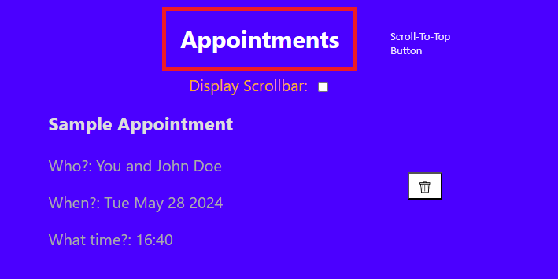

# Time-Wise: An Appointment Management App

## Overview
**Time-Wise** is a Single Page Application (SPA) designed to help you manage your appointments and contacts efficiently. Built with modern web technologies, it provides a seamless user experience for scheduling and organizing your tasks.

## Technologies Used
- **HTML**: For structuring the web pages.
- **CSS**: For styling the application.
- **JavaScript**: For dynamic functionality.
- **React.js**: For building the user interface and managing the state of the application.

## Features
### Appointment Management
- **Add Appointments**: Easily schedule new appointments with a user-friendly form.
- **Remove Appointments**: Delete any appointment that you no longer need.
- **View Appointment List**: See all your appointments sorted chronologically.
- **Smooth Scrolling for Appointments**: Automatically scroll down to the most recently added appointment, enhancing the user experience.
- **Prevent Past Appointments**: The appointment form dynamically updates to prevent users from scheduling appointments in the past.

### Contact Management
- **Add Contacts**: Add new contacts with their details.
- **Remove Contacts**: Remove contacts you no longer need.
- **View Contact List**: View your contacts sorted alphabetically.
- **Smooth Scrolling for Contacts**: Automatically scroll down to the most recently added contact, enhancing the user experience.

### User Interface Customization
- **Modify User Interface**: Choose between an aesthetic UI and a more intuitive UI. Decide whether or not the scrollbar is displayed on the page while maintaining scrolling functionality.

### Navigation Enhancement
- **Scroll to Top**: The subheading at the top of each list page ('Contacts' or 'Appointments') serves as a button to scroll to the top of the respective list. This provides quick and easy navigation within the lists.

  
  <br>
  *The 'Contacts' or 'Appointments' subheadings serve as the Scroll to Top button.*

## Getting Started
To get started with Time-Wise, follow these steps:

1. **Clone the repository**:
    ```bash
    git clone https://github.com/your-username/time-wise.git
    cd time-wise
    ```

2. **Install dependencies**:
    ```bash
    npm install
    ```

3. **Run the application**:
    ```bash
    npm start
    ```
    The app will be available at `http://localhost:3000`.

## Usage
- Navigate to the **Appointments Page** to add, view, or remove appointments.
- Go to the **Contacts Page** to manage your contacts.
- Use the **UI customization options** to toggle between different user interface styles.
- Use the **'Contacts'** or **'Appointments'** subheadings to scroll to the top of the respective list quickly.

## Contributing
Contributions are welcome! Please follow these steps to contribute:

1. Fork the repository.
2. Create a new branch (`git checkout -b feature-branch`).
3. Make your changes and commit them (`git commit -m 'Add some feature'`).
4. Push to the branch (`git push origin feature-branch`).
5. Open a Pull Request.

## License
This project is licensed under the MIT License. See the LICENSE file for details.
